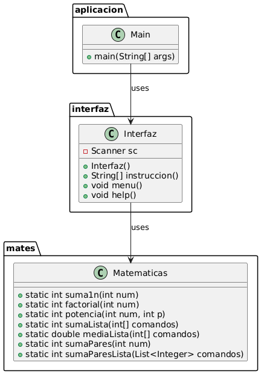

# Aplicación Matemática en Java

Este proyecto es una aplicación en Java que realiza varias operaciones matemáticas a través de una interfaz de consola.

## Funciones lambda

Una expresión lambda en Java es una forma concisa de representar funciones anónimas que facilita la programación funcional y reduce la verbosidad del código. Su sintaxis básica es (parametros) -> { cuerpo de la expresión } y se utiliza comúnmente con interfaces funcionales. Estas expresiones permiten escribir código más limpio y legible

## Estructura del Proyecto

El proyecto está organizado en tres paquetes principales:

1. **aplicacion**
2. **interfaz**
3. **mates**

### Paquete `aplicacion`

- **Clase `Main`**: Inicia la aplicación y llama al método `menu` de la clase `Interfaz`.

### Paquete `interfaz`

- **Clase `Interfaz`**:
    - **Atributos**:
        - `Scanner sc`: Para leer la entrada del usuario.
    - **Métodos**:
        - `Interfaz()`: Constructor que inicializa el `Scanner`.
        - `String[] instruccion()`: Lee una instrucción del usuario y la divide en partes.
        - `void menu()`: Muestra un menú de opciones y ejecuta diferentes operaciones matemáticas según la instrucción del usuario.
        - `void help()`: Muestra las instrucciones disponibles.

### Paquete `mates`

- **Clase `Matematicas`**: Contiene métodos estáticos para realizar operaciones matemáticas.
    - **Métodos**:
        - `static int suma1n(int num)`: Suma de 1 a `num`.
        - `static int factorial(int num)`: Factorial de `num`.
        - `static int potencia(int num, int p)`: Potencia de `num` elevado a `p`.
        - `static int sumaLista(int[] comandos)`: Suma de los elementos de una lista.
        - `static double mediaLista(int[] comandos)`: Media aritmética de los elementos de una lista.
        - `static int sumaPares(int num)`: Suma de los números pares hasta `num`.
        - `static int sumaParesLista(List<Integer> comandos)`: Suma de los números pares en una lista.

## Instrucciones de Uso

1. Clona el repositorio en tu máquina local.
2. Compila las clases Java.
3. Ejecuta la clase `Main` para iniciar la aplicación.
4. Sigue las instrucciones en la consola para realizar las operaciones matemáticas.

## Ejemplos de Instrucciones

- `1,10`: Suma de 1 a 10.
- `2,5`: Factorial de 5.
- `3,2,3`: Potencia de 2 elevado a 3.
- `4,1,2,3,4`: Suma de los números en la lista [1, 2, 3, 4].
- `5,1,2,3,4`: Media aritmética de la lista [1, 2, 3, 4].
- `6,10`: Suma de los números pares hasta 10.
- `7,1,2,3,4`: Suma de los números pares en la lista [1, 2, 3, 4].

## Diagrama UML

## Autor

Luis Holgado Arranz y Jesus Alejandro Hernandez Mendez